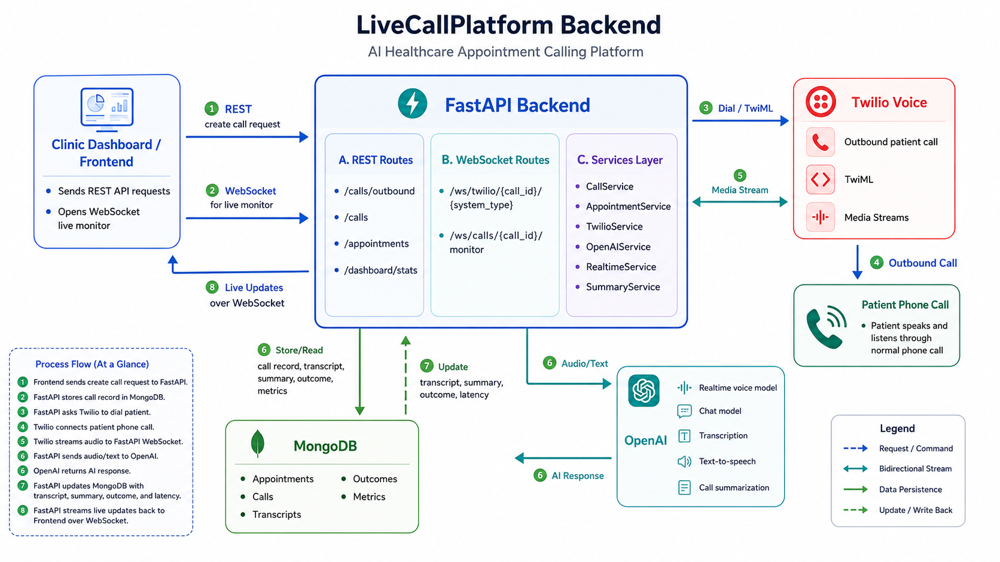
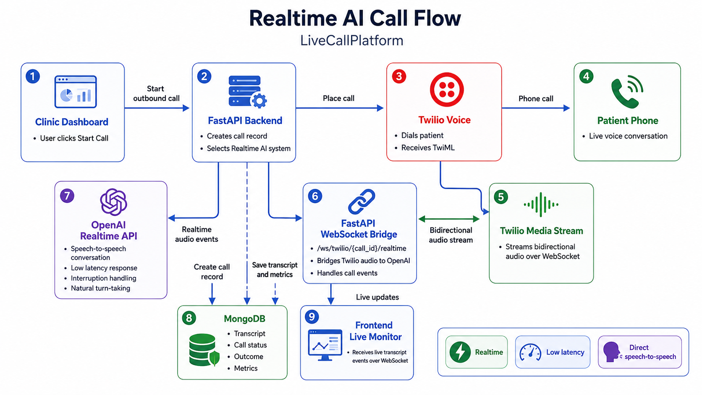
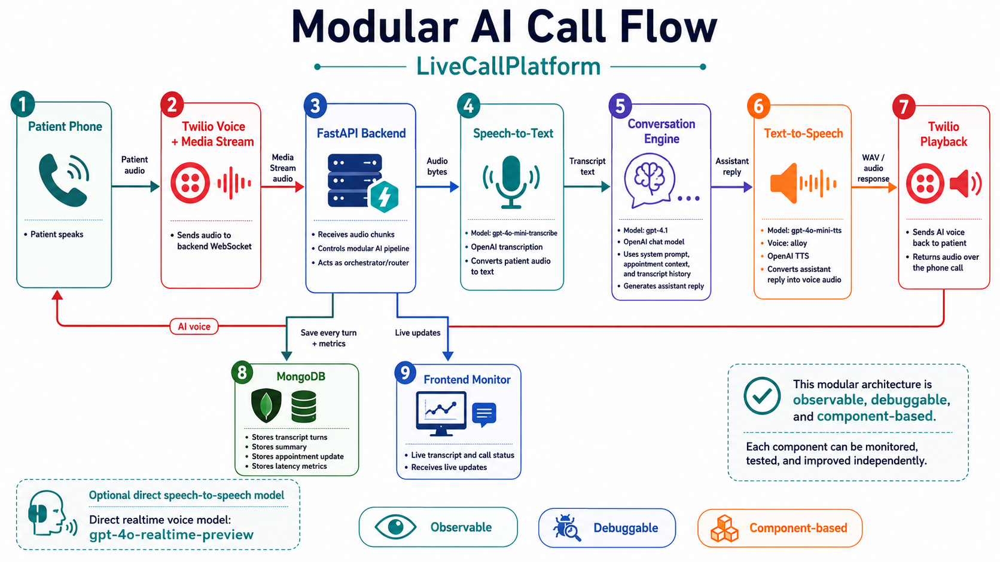

# Maya Voice Agent Backend

FastAPI backend for a browser-native healthcare AI voice agent. It manages authenticated demo users, appointment records, browser voice sessions, live transcripts, AI summaries, appointment outcomes, and analytics for clinic operations teams.

This branch replaces Twilio phone calling with microphone-based AI voice sessions in the web app.



## Real Use Case

This product is based on a real healthcare operations workflow: clinics spend staff time calling patients to confirm appointments, handle reschedules, answer simple logistics questions, and mark appointment outcomes. The original production workflow used Twilio Voice for real outbound automated calls to patients. In that setup, the AI agent called the patient, handled most confirmation or rescheduling conversations, saved the transcript and summary, updated appointment status, and escalated unclear or sensitive cases to clinic staff.

This branch keeps the same workflow, data model, AI behavior, summaries, and appointment automation, but exposes it as a browser-native voice session so evaluators can test the agent directly without placing real phone calls.

## What This Service Does

- Creates browser-native AI voice sessions for appointment confirmation and rescheduling.
- Supports two AI systems: OpenAI Realtime and a modular STT -> LLM -> TTS pipeline.
- Streams browser microphone audio over WebSockets.
- Stores transcripts, summaries, outcomes, sentiment, appointment updates, latency, and duration in MongoDB.
- Provides signup, login, JWT auth, email verification, and 4-hour demo trial enforcement.
- Protects dashboard, appointment, and session APIs by authenticated user.
- Handles English, Urdu, and mixed Urdu-English conversations through prompt-driven AI behavior.
- Escalates unclear, sensitive, or out-of-scope requests through structured summary metadata.

## Architecture

The backend is a voice-orchestration layer between the React dashboard, OpenAI, and MongoDB.

Users create a patient session in the frontend, select either Realtime AI or Modular AI, and start a browser microphone session. FastAPI stores the session, accepts WebSocket audio from the browser, routes the stream to the selected AI pipeline, persists transcript turns, and generates a structured summary when the session ends.

Core business logic lives in `app/services`, API routes stay thin under `app/api/routes`, and WebSocket lifecycle handling lives in `app/websocket`.

## Voice Systems

### Realtime AI Session

The realtime path is optimized for natural speech-to-speech interaction, interruption handling, and low latency.

```text
Browser microphone
  -> FastAPI WebSocket proxy
  -> OpenAI Realtime API
  -> FastAPI WebSocket
  -> Browser audio playback
```



### Modular AI Pipeline

The modular path is optimized for observability, debugging, and experimentation.

```text
Browser microphone segment
  -> FastAPI WebSocket
  -> OpenAI STT
  -> GPT conversation model
  -> OpenAI TTS
  -> Browser audio playback
```



## AI Models

- **Realtime voice**: `gpt-realtime-2`
- **Speech-to-text**: `gpt-4o-mini-transcribe`
- **Conversation LLM**: `gpt-4.1`
- **Text-to-speech**: `gpt-4o-mini-tts`
- **TTS voice**: `alloy`

## Tech Stack

- FastAPI
- Python async services
- MongoDB with Motor
- OpenAI Realtime, chat, transcription, and text-to-speech APIs
- WebSockets for browser audio streaming
- JWT authentication
- Email OTP verification

## Setup

Run these commands from the `backend/` directory:

```bash
python -m venv .venv
source .venv/bin/activate
pip install -r requirements.txt
cp .env.example .env
```

Update `.env`:

```env
APP_NAME="Maya Voice Agent"
ENVIRONMENT=development
API_BASE_URL=http://localhost:8000
FRONTEND_URL=http://localhost:5173
CLINIC_NAME="CityCare Clinic"
DEFAULT_RESCHEDULE_SLOTS="Thursday 11:00 AM, Friday 4:00 PM"

MONGODB_URI=mongodb://localhost:27017
MONGODB_DB=health_voice_calls

OPENAI_API_KEY=your-openai-api-key
OPENAI_CHAT_MODEL=gpt-4.1
OPENAI_REALTIME_MODEL=gpt-realtime-2
OPENAI_TTS_VOICE=alloy

JWT_SECRET=replace-with-a-long-random-secret

SMTP_HOST=
SMTP_PORT=587
SMTP_USERNAME=
SMTP_PASSWORD=
SMTP_USE_TLS=true
EMAIL_FROM=
```

If SMTP settings are empty, verification OTPs are written to backend logs for local development.

Start the API:

```bash
uvicorn app.main:app --reload
```

The backend runs at:

```text
http://localhost:8000
```

## Key Routes

- `POST /auth/signup` creates an account and sends a verification OTP.
- `POST /auth/verify` verifies email and starts a 4-hour demo trial.
- `POST /auth/login` returns a JWT for verified users.
- `GET /auth/me` returns the current user and trial metadata.
- `POST /sessions` creates a patient AI voice session.
- `GET /sessions` lists session history.
- `GET /sessions/{id}` returns transcript, summary, outcome, latency, and metadata.
- `GET /appointments` lists appointments.
- `POST /appointments` creates an appointment.
- `PATCH /appointments/{id}` updates appointment status or details.
- `GET /dashboard/stats` returns dashboard metrics.
- `WS /ws/sessions/{id}/voice` streams browser audio and AI audio events.

## Architecture Image Prompts

Use these prompts to regenerate and replace the existing images in `backend/docs/images`.

### `backend-architecture.png`

Create a clean SaaS architecture diagram for a browser-native healthcare AI voice agent backend. Style: modern flat technical diagram, dark navy background, teal and amber accent colors, crisp labels, no cartoons, no 3D. Show these blocks left to right: React Clinic Dashboard, FastAPI Backend, MongoDB, OpenAI APIs. Under FastAPI show modules: Auth + JWT + Email OTP, Sessions API, Appointments API, Dashboard API, WebSocket Voice Gateway, Summary Service. Show browser microphone audio entering WebSocket Voice Gateway. Split from WebSocket Voice Gateway into two paths: OpenAI Realtime API path and Modular STT -> GPT -> TTS path. Show transcripts, summaries, outcomes, latency, duration, and appointment updates stored in MongoDB. Include a small note: 4-hour verified demo trial enforcement on protected routes. Export as 16:9 PNG, readable text, high contrast.

### `realtime-call-flow.png`

Create a clean sequence/flow diagram for the Realtime AI voice path in a browser healthcare appointment assistant. Style: dark SaaS technical diagram, teal highlights, simple arrows. Flow: Browser Microphone -> FastAPI WebSocket Proxy -> OpenAI Realtime API -> FastAPI WebSocket Proxy -> Browser Audio Playback. Add side events: live transcript events, active speaker updates, interruption handling, session completion. Show MongoDB receiving transcript turns and final summary metadata. Label this as "Realtime AI Session Flow". Export as 16:9 PNG with readable labels.

### `modular-call-flow.png`

Create a clean sequence/flow diagram for the Modular AI voice pipeline in a browser healthcare appointment assistant. Style: dark SaaS technical diagram, teal and amber accents, simple arrows. Flow: Browser records short audio segment -> FastAPI WebSocket -> OpenAI Speech-to-Text -> GPT Conversation Model -> OpenAI Text-to-Speech -> Browser Audio Playback. Show MongoDB storing transcript turns, latency metrics, duration, summary, sentiment, outcome, and appointment update. Add note: "Observable STT -> LLM -> TTS pipeline for debugging and analytics." Export as 16:9 PNG with readable labels.
